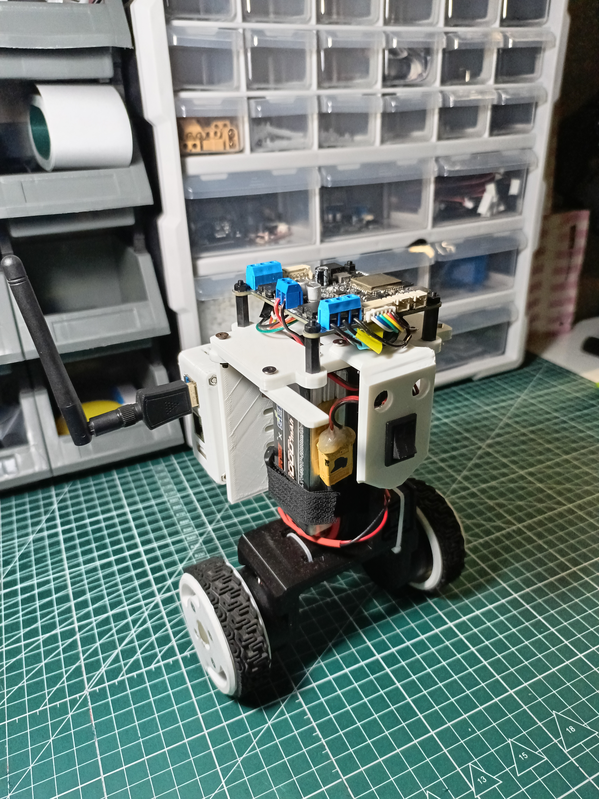
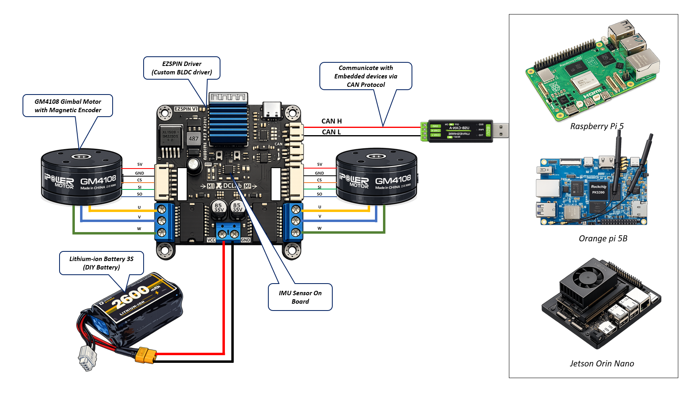

# EzSpin Balancing Bot 🤖⚙️

## Overview

EzSpin Balancing Bot is a two-wheel self-balancing mobile robot powered by a custom BLDC motor driver.  
The system is designed to control gimbal-type BLDC motors equipped with magnetic encoders via SPI communication.  

The custom motor driver also integrates an onboard IMU, providing real-time feedback for closed-loop control and robot stabilization.

---

## Features

- Two-wheel self-balancing mobile platform  
- Onboard IMU sensor for attitude estimation  
- Cascaded PID control architecture  
- BLDC motor control using the SimpleFOC library  
- CAN communication protocol support  
- Supports position, velocity, and torque control modes  
- Multi-platform support: ROS 2, Arduino IDE, MATLAB/Simulink  
- Expandable for autonomous navigation and AI applications  

---

## Robot Overview

### Robot Image



---

### Control Architecture


---

### System Architecture



---

## Hardware

### Main Components

| Component       | Description                          |
|----------------|--------------------------------------|
| MCU            | ESP32                                |
| IMU            | MPU6050                              |
| Motor Driver   | EzSpin Custom BLDC Driver            |
| Motors         | GM4108 with Magnetic Encoder         |
| Battery        | EzSpin DIY Li-ion Battery (3S)       |
| Communication  | CAN Bus                              |

---

## Software Architecture

The software is structured into modular layers:

- Sensor acquisition  
- Sensor fusion  
- State estimation  
- Balance controller  
- Speed controller  
- Steering controller  
- Motor control layer  
- Communication interface (CAN / ROS 2)  

---

## Control Structure

```text
Desired Velocity
        |
        v
Speed Controller
        |
        v
Balance Controller
        |
        v
Motor Controller
        |
        v
BLDC Motors
