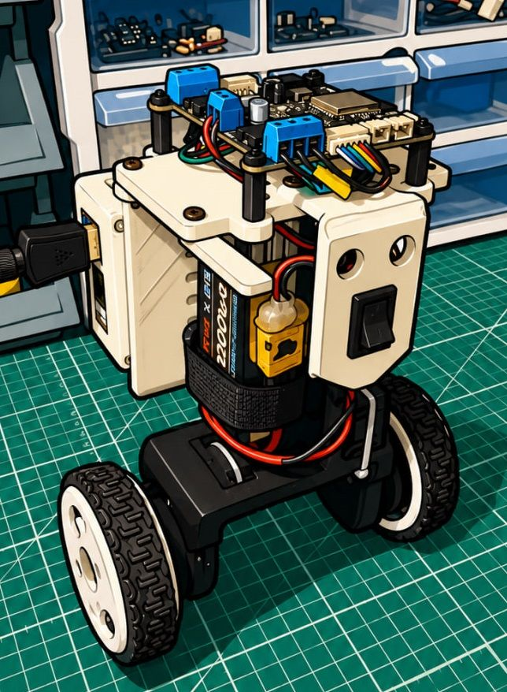
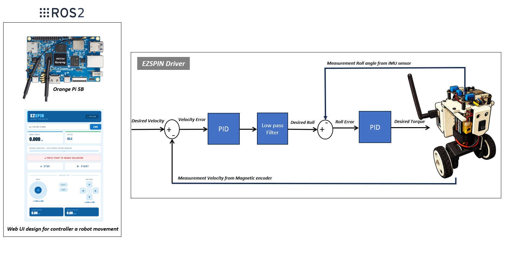
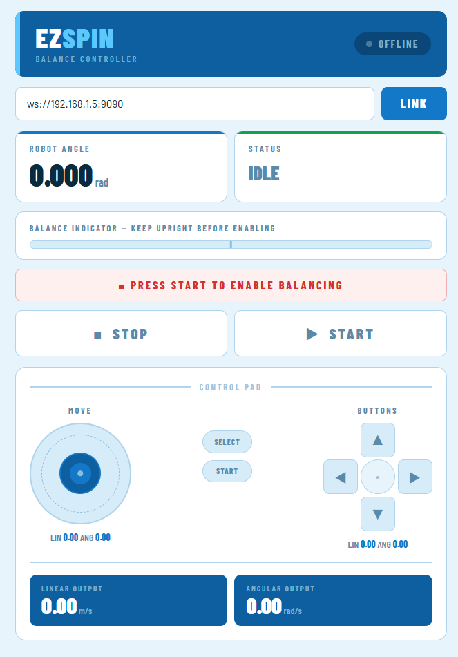

# EzSpin Balancing Bot 🤖⚙️

  

## Overview
EzSpin Balancing Bot is a two-wheel self-balancing mobile robot powered by a custom BLDC motor driver.  
The system is designed to control gimbal-type BLDC motors equipped with magnetic encoders via SPI communication.
The custom motor driver also integrates an onboard IMU, providing real-time feedback for closed-loop control and robot stabilization.

---

## Features

- Two-wheel self-balancing mobile platform  
- Onboard IMU sensor for attitude estimation  
- Cascaded PID control architecture  
- BLDC motor control using the SimpleFOC library  
- CAN communication protocol support  
- Supports position, velocity, and torque control modes  
- Multi-platform support: ROS 2, Arduino IDE, MATLAB/Simulink  
- Expandable for autonomous navigation and AI applications  

---

## Robot Overview

### Control Architecture

The EzSpin Balancing Bot maintains stability using a cascade PID control architecture, consisting of an outer velocity control loop and an inner position control loop. The system can be further extended by integrating an Orange Pi 5B running ROS 2, enabling advanced high-level control and communication. A web-based GUI can be developed to send real-time velocity commands, which are then transmitted from the ROS 2 system to the EzSpin controller via the CAN bus protocol for robot motion control and balancing.

---

### System Architecture

The EzSpin controller is capable of controlling up to two motors simultaneously while utilizing onboard IMU feedback for real-time stabilization and motion control. The EzSpin board is designed as a ready-to-use solution that supports position, velocity, and torque control modes through both Serial and CAN Bus communication interfaces.

---

### Web GUI

A web-based GUI is developed for real-time control of the EzSpin Bot by sending velocity commands to the robot. The commands are transmitted through the ROS 2 system and communicated to the EzSpin controller via the CAN Bus protocol, enabling responsive and interactive robot operation.

  

## Hardware

### Main Components

| Component       | Description                          |
|----------------|--------------------------------------|
| MCU            | ESP32                                |
| IMU            | MPU6050                              |
| Motor Driver   | EzSpin Custom BLDC Driver            |
| Motors         | GM4108 with Magnetic Encoder         |
| Battery        | EzSpin DIY Li-ion Battery (3S)       |
| Communication  | CAN Bus                              |

---

